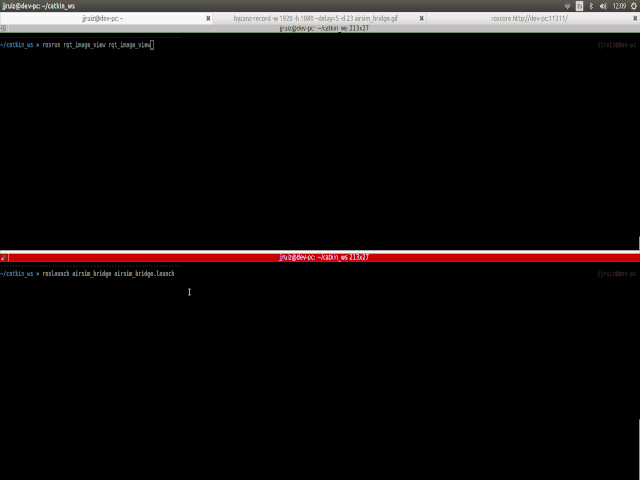

# airsim_bridge



*Note: Currently testing in a low-capable setup*

The aim of this repository is to create a bridge between the computer vision mode in [Airsim](https://github.com/Microsoft/AirSim) and the well-known [ROS](http://wiki.ros.org/kinetic) framework.

**ADVICE**: This repository is **under development**. The main maintainer is J.J. Ruiz from the [Service Robotics Labs](https://github.com/robotics-upo) at the University Pablo de Olavide to support his PhD in Computer Vision applied to Robotics. It is not intended to be a general solution but it could be a starting point for some of you. Feel free to clone, fork and add any new functionality.

## Ultimate goal

To create a bridge to link a ROS ecosystem with a cooperative multi-vehicle simulation from Airsim. And obviously, to be able to process different image streams from that simulation.

## Features

This repository implements a bridge between airsim and ROS. Similar content was published in other [repository](https://github.com/marcelinomalmeidan/publishAirsimImgs). Nonetheless, main features are simplified:

* Publish RGB images in a ROS topic
* Embed exiv metadata from the airsim in the images and save as .jpg for offline analysis (TODO).
* Publish a special topic with metadata and images to be analyzed by a mosaicing algorithm.

The main reason to create another repository is to simplify and adapt the content of the ros package to the requirements from the work developed in the thesis.

## Pre-requisites

From the pre-requisites point-of-view, only an stable ros distribution is required:

```
sudo apt-get install ros-kinetic-desktop
```
On the other hand, a special compilation of airsim is required. Instructions in [publishAirsimImgs](https://github.com/marcelinomalmeidan/publishAirsimImgs) are outdated if you clone the latests airsim version.

In order to compile airsim, follow:


* Replace the /Airsim/build.sh with the build.sh in /**airsim_config**/ in the current repo.
* Replace the /Airsim/cmake/CMakeLists_cmake_folder.txt with the CMakeLists1.txt in /extras/ in the current repo. 
* Rename it to CMakeLists.txt.
* Replace the /Airsim/cmake/MavLinkCom/CMakeLists.txt with the CMakeLists_cmake_mavlinkcom.txt in /**airsim_config**/ in the current repo. Rename it to CMakeLists.txt.
* Run "build.sh" from Airsim's root directory.
 

 Basically, these are the same instructions from publishAirsimImgs but updated with some modifications. At some point, an error with **fabsf** not being part of the std namespace will occur. This issue has been already published [here](https://github.com/Microsoft/AirSim/issues/893). To fix it, search the files with that call and replace them with the fabs function and continue with the compilation.

 Finally, modify the airsim_bridge CMakelist.txt:

```
 SET (AIRSIM_ADDRESS pathToAirsim/AirLib)
```
## Launch file

The easiest way to modify the parameters in airsim_bridge is to do it directly in the airsim_bridge.launch file under the launch folder. You can modify

* airsim_ip 
* airsim_port
* image_freq


